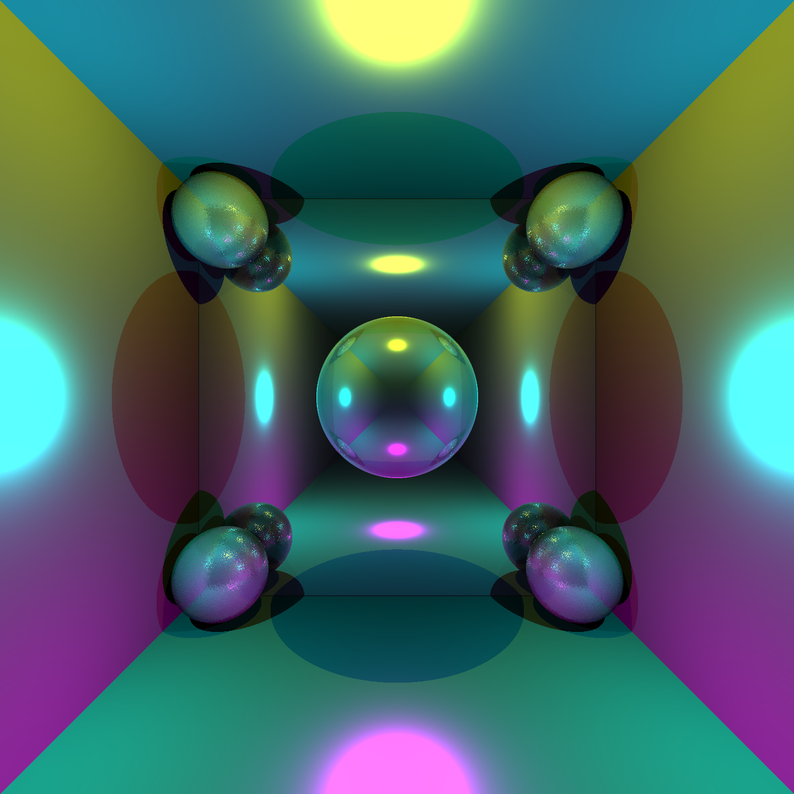

# OCaml Ray Tracer



## Introduction

This is a re-implementation of homework 3 of CS 4810 computer graphics. It is translated from my original C++ implementation. Some OCaml constructs are inspired by https://www.ffconsultancy.com/languages/ray_tracer/comparison.html. This serves as the course project of CS 4610 Programming Languages. I am required to stick to the functional programming style, so imperative OCaml constructs are mostly avoided.

The homework description can be found at https://www.cs.virginia.edu/luther/4810/F2020/hw3.html. It includes command and feature specification. 

The following subset of commands are implemented:

- sphere
- sun
- color
- plane
- bulb
- shininess
- roughness
- bounces

The following (non-command) feature are supported

- overlapping objects
- shadows
- multiple light sources
- negative light

## How to use

Make sure that you have an Unix-like environment. Note that my code is only tested on Ubuntu 18.04. The image IO part of this project requires bimage-unix, which is a wrapper of ImageMagick. 

Install prerequisites: bimage, bimage-unix and imagemagick. Also, since this project is inherently computationally expensive, it is recommended to install OCaml with Flambda enabled, so the compiled code runs faster. 

```bash
# install OCaml with Flambda
opam switch create 4.11.1+flambda
# install ImageMagick
sudo apt install imagemagick
# install library dependencies
opam install bimage bimage-unix 
```

Build and run on sample inputs

> Note: most of the input files are selected from https://www.cs.virginia.edu/luther/4810/F2020/hw3.html, but their output resolution is increased 8x so the output image won't look pixelated. 

> random1.txt, random2.txt, and random3.txt are extra input files I created.

```bash
bash run.sh
```

To run on custom inputs, you can use

```bash
dune build --profile release
./_build/default/raytracer.exe your_input_file.txt
```

For the input file format, you can refer to https://www.cs.virginia.edu/luther/4810/F2020/hw3.html or the text files included in this project. 

## Stress Test

> Note: the output resolution is increased to 1280x1280. The original input file (hw3many.txt) from the homework assignment renders to a 200x200 image. 

To run ray tracing stress test

```bash
bash stress.sh
```

It completed within 50s on my computer. My reference C++ implementation completed the stress test within 12s. Both implementations did not include acceleration techniques such as bounding box hierarchy.

## Programming Style

I tried my best to stick to the functional programming style. Most of the if statements are replaced with pattern matching, and for loops/summing loops are replaced with List.fold_left. 

However, in some cases it is almost inevitable to use mutable variables and some imperative constructs. For example, I must use a mutable list to record the list of objects that user specifies in the scene. 